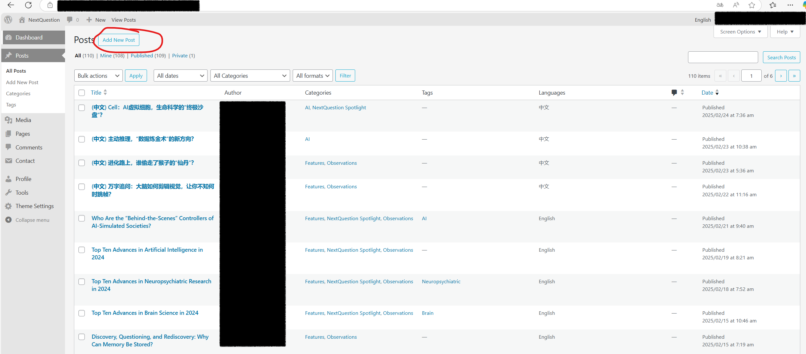

# WeSyncPress使用说明
简介：帮助微信公众号作者将微信文章同步到WordPress上。半自动化，需要作者手动编辑。  
 

## 下载和其他软件准备  

- 下载地址：https://github.com/Yu-Yawei/WeSyncPress/releases/tag/v0.0.1

      
    **图1**

    点击图1中的Assets下的第一个zip文件链接，开始下载。  
 

- 将下载的文件解压至指定的文件地址。

    
    **图2**  
 

- 找到解压的文件夹，打开图2中的WeSyncPress.exe文件，如果下载成功，应该看到图3中的内容：

      
    **图3**  
 

- 其他软件准备：html文件编辑器

    推荐使用vscode，下载地址：https://code.visualstudio.com/  
    本手册涉及html编辑的相关内容将使用vscode，如果您有其他html编辑器的使用偏好，也可以使用。注意：如果是在线HTML编辑器，最好能打开本地文件。  
 

## 文章准备  

- 复制需要同步的原网页地址。如图4中红圈所示  

    
    **图4**
 

- 点击图3中"同步前设置"选项，会看到如图5界面。

      
    **图5**
 

- 在"待导出文章所在网页"中，将需要同步的原网页地址粘贴进去。  
 

- "导出图片与文章HTML输出文件夹"一栏需要输入储存在本地的文件夹名称，以便之后调取。  
 

- "为同一篇文章导出的图片设置名称标记"一栏设置需要上传的图片的文件名前缀，例如在设置标记为"虚拟细胞"后，所有图片的名称就变为了"image_虚拟细胞\_（序号）"，如图6

    
    **图6**  
 

- "设置该路径为WordPress图片库网页链接或本地文件夹路径"一栏需要输入WordPress当月存放图片的地址（在完全仅供本地浏览不需要将文章上传至WordPress的情形下也可以输入本地路径）。具体寻找方法如下，这里以nextquestion网站为例：

    - 打开nextquestion的WordPress管理后台

        
        **图7**  
         
    - 登陆后，在最左侧栏中选中"Media"，如图8中红圈所示，打开后界面应如图8所示

        
        **图8**  
         
    - 打开本月已上传的图片，如果本月未上传过图片可以随意先上传一个图片，然后打开该图片，点击"copy URL to clipboard"，如图9红圈部分所示。

        
        **图9**  
         
    - 将图片的名称部分删除，如图10高亮部分所示，仅保留上级网址路径。

        
        **图10**  
         
    - 将余下部分复制到图5中的框4内，即"设置该路径为WordPress图片库网页链接或本地文件夹路径"。  
 

- "草稿HTML文件名"一栏会设置预览用的草稿HTML文件的名称，无需变化，或者只要与"定稿HTML文件名"不同即可。  
 

- "定稿HTML文件名"一栏是最后上传版本的HTML文件的名称，无需变化，或者只要与"草稿HTML文件名"不同即可。  
 

- 点击"保存并退出"。  
 

- 点击"导出文章文稿"等待出现对话框，如图11所示。此时将自动根据之前指定的导出路径新建需要同步的文章导出的文件夹，如图12所示。

      
    **图11**  
     

      
    **图12**    
   
  
## 调整草稿  

- 打开导出文章的文件夹，可以找到一个名字与之前设置的草稿HTML文件名相同的HTML文件。如图13所示

    
    **图13**  
 

- 使用vscode打开该草稿文件，编辑草稿内容，例子：WordPress中，文章标题、作者、文章正文三者由不同的编辑框编写，在文章正文中，不需要保留公众号文章的标题和作者等元素，而WeSyncPress编辑的主要是贴入正文编辑框的内容，此时可以在草稿文件中找到需要删除的元素，将该元素对应的代码行及其上一行、下一行的代码删除。  
 

- 保存并关闭vscode。打开WordPress图片库。点击"add new media file"，点击"select file"，选择本地草稿文件夹中所有**图片**。如图14：

    
    **图14-1**  
     

    
    **图14-2**  
     

    
    **图14-3选中所有图片，点击右下角"打开"**  
 

## 发布文章  

- 使用浏览器打开草稿HTML文件，即可进行审阅。如果找到需要删去的文字，可用vscode打开草稿HTML文件查找这段内容，然后连同该内容和其上下两行代码一同删去。  
 

- 审阅完成后，点击"调整为WordPress适用格式"。会弹出图15的提示框，这时检查导出文件夹，会发现多出一个定稿HTML文件。

    
    **图15**  
 

- （可选）使用浏览器打开定稿HTML文件，进行检查，无误后进入下一步；如发现需要修改的地方，可重新修改草稿HTML，再点击"调整为WordPress适用格式"重新定稿。  
 

- 打开WordPress后台，点击"post"选项，会出现如图16的界面。

    
    **图16**  
 

- 点击"add new post"（图17-1）,会出现图17-2的界面，在最上方选择需要更新的对应语言，如中文。

    
    **图17-1**  
     

    
    **图17-2**  
 

- 通过"featured image"一栏设置文章题图，如下图所示。题图应先上传至WordPress图片库。通过页面最上方的"add title"一栏设置文章标题。

    
    **图18-1**  
 

- 用vscode打开定稿HTML文件，选中全部内容，复制到图19-1红圈所示的正文编辑栏中。然后如图19-2所示设置如作者、标签等文章的其它信息。最后在图19-1右下角紫框所示位置点击"publish"发布。

    
    **图19-1**  
     

    
    **图19-2**  
     

    
    **图19-3**  
 

- 最后在网页上检查发表的内容。如有需要修改的地方，可点击"edit"进行修改，如图20所示

    
    **图20**

---

*如果在使用中遇到任何问题或有新功能需求，请在"Contact Developer"中找到开发者信息，并在Github上联系开发者。*  
*感谢：追问nextquestion平台提供的测试支持；本使用文档的编写者-追问nextquestion编辑雨飞；本需求的启发者-追问nextquestion主编存源。*
